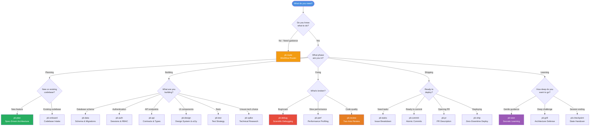
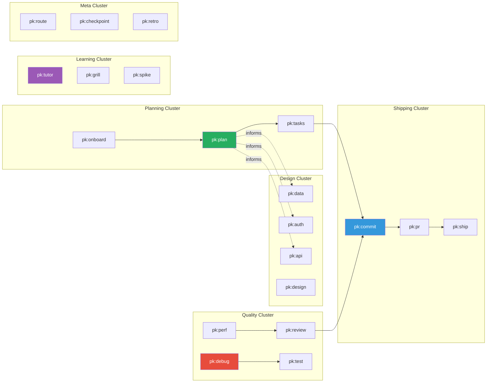

# Better-PromptKit Workflow Decision Map

Visual guide to help you quickly find the right workflow for your current task.

---

## Work Classification First

Before selecting a workflow, classify the request:

- **Trivial Work** is short, bounded, and single-concern. Use the existing fast path without creating unnecessary execution records.
- **Controlled Work** changes durable files, task state, project configuration, commits, pull requests, release artifacts, or multiple independent concerns. Route it through readiness and create the canonical Local Task Source at `docs/tasks/<task-id>.md` before implementation.

The Task Record is authoritative for Controlled Work. `docs/STATE.md` is a synchronized projection owned by `pk:checkpoint`; external issues, dated breakdowns, board statuses, and conversation claims are supporting references. This follow-up is additive to the immutable published `v1.0.0` baseline and is not an approved `v1.1.0` release.

---

## Interactive Decision Tree



---

## Quick Reference: "I Want To..." → Use This

### 🎯 Planning & Design
| I Want To... | Use | Output |
|:---|:---|:---|
| Plan a new feature from scratch | `pk:plan` | `docs/specs/*.md` |
| Understand an existing codebase | `pk:onboard` | `PROMPTKIT.md` + `docs/STATE.md` |
| Design database schema | `pk:data` | `docs/data/*.md` |
| Design auth & permissions | `pk:auth` | `docs/auth/*.md` |
| Design API contracts | `pk:api` | `docs/api/*.md` |
| Create design system | `pk:design` | `docs/design/*.md` |
| Research tech options | `pk:spike` | `docs/spikes/*.md` |

### 🔨 Building & Testing
| I Want To... | Use | Output |
|:---|:---|:---|
| Break feature into tasks | `pk:tasks` | `docs/tasks/<task-id>.md` plus optional issue/index |
| Write test strategy | `pk:test` | `docs/tests/*.md` |
| Learn without code dumps | `pk:tutor` | Interactive learning |
| Challenge my architecture | `pk:grill` | Socratic defense drill |

### 🐛 Debugging & Optimization
| I Want To... | Use | Output |
|:---|:---|:---|
| Fix a bug systematically | `pk:debug` | Root cause + regression test |
| Optimize performance | `pk:perf` | `docs/perf/*.md` + benchmarks |
| Review code quality | `pk:review` | Two-axis audit report |

### 🚀 Shipping & Collaboration
| I Want To... | Use | Output |
|:---|:---|:---|
| Make clean atomic commit | `pk:commit` | Conventional Commits |
| Write PR description | `pk:pr` | High-signal PR body |
| Deploy without downtime | `pk:ship` | `docs/releases/*.md` |
| Pause and hand off work | `pk:checkpoint` | Handover prompt + STATE.md |
| Capture decisions | `pk:retro` | ADRs in `docs/adrs/` |

### 🧭 Navigation & Routing
| I Want To... | Use | Output |
|:---|:---|:---|
| Find the right workflow | `pk:route` | Interactive decision matrix |
| See all commands | `pk:route` | Full workflow catalog |

---

## Workflow Relationships

### Core Workflow Clusters



---

## Controlled Work Role Handoffs

| Role / owner | Durable handoff | Boundary preserved |
| :--- | :--- | :--- |
| Planner / Architect via `pk:plan` | Objective, scope, non-goals, dependencies, acceptance, verification, and locked invariants into the Task Record inputs | Planning does not start implementation or approve remote actions. |
| `pk:tasks` | Stable Task ID, canonical `docs/tasks/<task-id>.md`, acceptance IDs, and existing board-status mapping | The Local Task Source remains the authority; external issues are optional. |
| Engineer | Implementation within scope, checkpoints, changed-file evidence, and one prioritized next action | Scope expansion requires a Scope Change Record before edits. |
| QA / Reviewer via `pk:review` | Review findings, acceptance results, revision, CI evidence, and review evidence | Review does not silently repair records or approve releases. |
| `pk:commit` / `pk:pr` | Human-confirmed commit and PR evidence linked to the Task Record | Evidence consistency never authorizes commit, merge, or deployment. |
| Release Coordinator via `pk:ship` | Release-impact evaluation and release checklist evidence | Tag, publication, deployment, and rollback remain separate human decisions. |

Session or role boundaries use `pk:checkpoint`: `docs/STATE.md` is synchronized as a projection, while the receiver validates the Task ID, revision, changed files, acceptance, blockers, invariants, and next action in the canonical records.

---

## Common Task Sequences

### Sequence 1: Controlled New Feature (Full Cycle)
```
pk:route → readiness → pk:plan → pk:tasks → docs/tasks/<task-id>.md → pk:data/pk:api/pk:test → [Build] → pk:checkpoint → pk:review → pk:commit → pk:pr → pk:ship
```

### Sequence 2: Bug Fix
```
pk:debug → [Fix] → pk:test → pk:commit → pk:pr
```

### Sequence 3: Performance Issue
```
pk:perf → [Optimize] → pk:review → pk:commit
```

### Sequence 4: Learning & Research
```
pk:tutor → [Practice] → pk:grill → [Strengthen]
```

### Sequence 5: Codebase Onboarding
```
pk:onboard → pk:tutor → pk:plan → [Continue]
```

### Sequence 6: Session or Role Handoff
```
[Work within Task Record scope] → pk:checkpoint → [Receiver validates revision, files, acceptance, blockers, invariants, next action] → [Resume]
```

---

## Workflow Complexity Matrix

Visual guide to workflow depth and time investment:

| Workflow | Typical Duration | Complexity | Frequency |
|:---|:---|:---|:---|
| `pk:route` | 10 sec | ⚪ Low | Every session |
| `pk:commit` | 2 min | ⚪ Low | Multiple/day |
| `pk:review` | 5-10 min | 🟡 Medium | Before each PR |
| `pk:debug` | Varies | 🟡 Medium | As needed |
| `pk:tutor` | 10-20 min | 🟡 Medium | Daily learning |
| `pk:checkpoint` | 3 min | ⚪ Low | Session end |
| `pk:plan` | 15-45 min | 🔴 High | Per feature |
| `pk:data` | 20-40 min | 🔴 High | Per schema |
| `pk:ship` | 10-30 min | 🔴 High | Per release |
| `pk:grill` | 15-30 min | 🔴 High | Deep dives |

---

## Emergency Quick Reference

When you're stuck and need immediate help:

```
┌─────────────────────────────────────────────────┐
│  STUCK? START HERE:                             │
├─────────────────────────────────────────────────┤
│  "I don't know what to do" → pk:route           │
│  "This is broken" → pk:debug                    │
│  "I'm confused" → pk:tutor                      │
│  "Is this code good?" → pk:review               │
│  "How do I...?" → pk:tutor                      │
│  "Should I use X or Y?" → pk:spike              │
└─────────────────────────────────────────────────┘
```

---

## Integration Points

How workflows feed into each other:

- **`pk:route`** classifies Trivial versus Controlled Work and routes readiness without creating a new trigger.
- **`pk:plan`** generates architecture/spec inputs that **`pk:tasks`** turns into a canonical `docs/tasks/<task-id>.md` Task Record.
- **`pk:tasks`** maps the Task Record to existing board statuses; issues and dated breakdowns are optional indexes, not alternate authority.
- **`pk:checkpoint`** preserves checkpoints, handoffs, and the synchronized `docs/STATE.md` projection; the Task Record remains authoritative.
- **`pk:debug`** findings inform **`pk:test`** regression coverage.
- **`pk:review`** catches fidelity, quality, and traceability issues before **`pk:commit`**.
- **`pk:commit`** creates human-confirmed clean history for **`pk:pr`**.
- **`pk:pr`** compiles evidence for review; approved code goes through **`pk:ship`**.
- **`pk:ship`** evaluates release impact without rewriting the immutable published `v1.0.0` baseline.
- Passing validators or CI checks supports durable evidence only and never authorizes a remote, release, deployment, or rollback action.

---

## Learning Path Recommendations

### Beginner Path (Weeks 1-2)
1. `pk:route` - Learn navigation
2. `pk:tutor` - Start learning mode
3. `pk:commit` - Practice clean commits
4. `pk:checkpoint` - Session management

### Intermediate Path (Weeks 3-6)
5. `pk:plan` - Feature planning
6. `pk:debug` - Scientific debugging
7. `pk:review` - Code quality
8. `pk:pr` - Professional PRs

### Advanced Path (Months 2-3)
9. `pk:data` - Schema design
10. `pk:auth` - Security patterns
11. `pk:perf` - Performance tuning
12. `pk:grill` - Architecture defense

### Expert Path (Ongoing)
13. `pk:ship` - Production releases
14. `pk:spike` - Research leadership
15. All workflows fluently

---

**Tip**: Bookmark this page or run `pk:route` anytime you're unsure which workflow to use!
